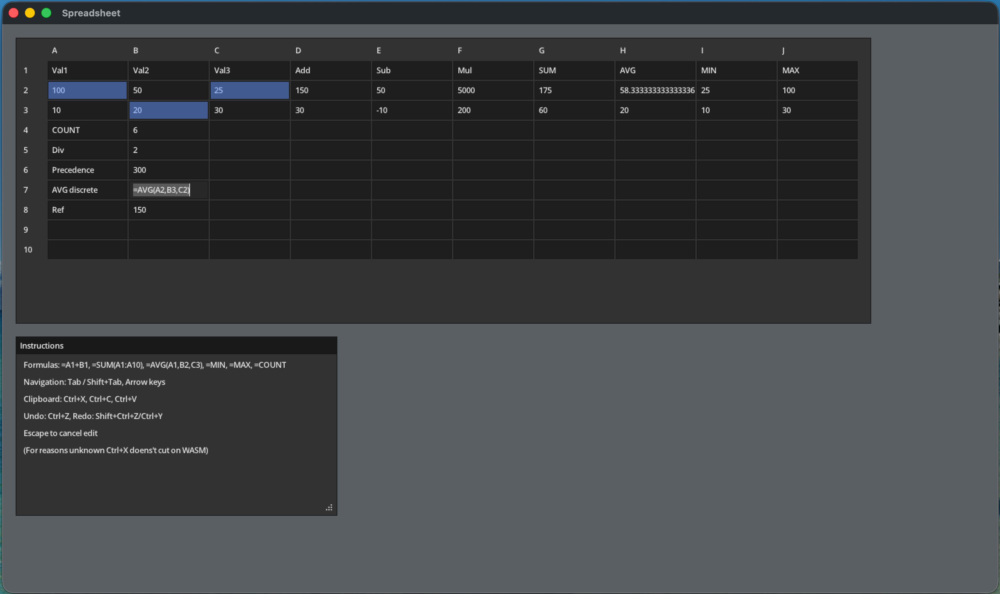

# wasmspreadsheet

A small spreadsheet prgoram. Runs natively (GLFW) or in the browser (WASM).



## Features

- 10×10 grid with cell references (A1, B2, …)
- Formulas: `=A1+B1`, `=SUM(A1:C1)`, `=AVG(...)`, `=MIN(...)`, `=MAX(...)`
- Undo/redo
- Copy/paste, cut

## Build

**Native (GLFW):**
```bash
./build_native.sh
```

**Web (WASM):**
```bash
./build_web.sh
```
Then serve the `web/` directory (e.g. `python -m http.server` in `web/`) and open `index.html`.

## Requirements

- [Odin](https://odin-lang.org/)
- For native: GLFW
- For web: a static file server for the `web/` folder
